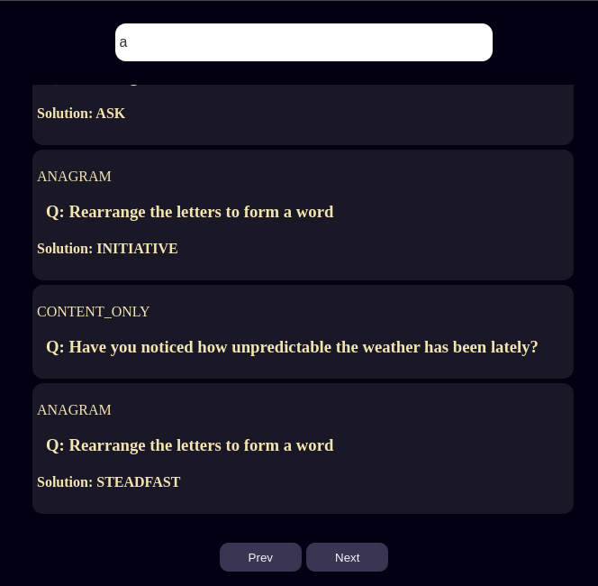

# speak_x_assignment

- example output


### steps to start the project

## for frontend
- open terminal 
- cd client
- npm i
- npm start

## for backend
- open another terminal 
- cd client
- npm i
- npm run dev

## for envoy server proxy
-  open another terminal at the root 
- paste ```./grpcwebproxy --backend_addr=localhost:50051 --backend_tls_noverify --run_tls_server=false --allow_all_origins```